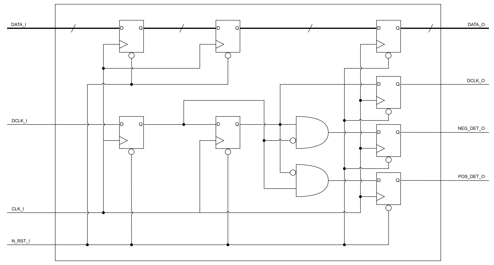
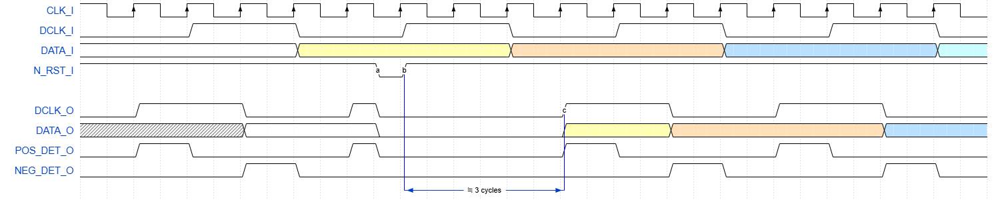

# FIREEEE_DCLK_EDGE_DET
Data clock edge detector.

## File List
| No. |             File name             |         Description         |
|:---:|:----------------------------------|:----------------------------|
|1    |README.md                          |Module Specification         |
|2    |FIREEEE_DCLK_EDGE_DET.v            |Module                       |
|3    |FIREEEE_DCLK_EDGE_DET_tb.sv        |Testbench                    |
|4    |fireeee_dclk_edge_det_no_reset.v   |Instance (No Reset)          |
|5    |fireeee_dclk_edge_det_sync_reset.v |Instance (Synchronous Reset) |
|6    |fireeee_dclk_edge_det_async_reset.v|Instance (Asynchronous Reset)|
|7    |Sim                                |Simulation Scripts           |
|8    |Sby                                |SymbiYosys Configurations    |

## Status
|        Item        |  Status  |
|:-------------------|:--------:|
|Version             |0.02      |
|Date                |2026/03/10|
|Verified            |Yes       |
|Real Machine Checked|No        |

## Verified Methods
- RTL simulation
- Code coverage
- Formal property check
- SystemVerilog assertion

## Port Definition
### Input
| Port name |   Description    |Synchronous / Asynchronous|Clock Domain|Active low|
|:----------|:-----------------|:------------------------:|:----------:|:--------:|
|CLK_I      |Clock             |-                         |-           |No        |
|DCLK_I     |Data Clock        |Synchronous               |CLK_I       |No        |
|DATA_I     |Data              |Synchronous               |CLK_I       |No        |
|N_RST_I    |Reset             |Synchronous / Asynchronous|CLK_I       |Yes       |

### Output
| Port name |   Description    |Synchronous / Asynchronous|Clock Domain|Active low|
|:----------|:-----------------|:------------------------:|:----------:|:--------:|
|DCLK_O     |Data Clock        |Synchronous               |CLK_I       |No        |
|DATA_O     |Data              |Synchronous               |CLK_I       |No        |
|POS_DET_O  |Positive Edge Flag|Synchronous               |CLK_I       |No        |
|NEG_DET_O  |Negative Edge Flag|Synchronous               |CLK_I       |No        |

## Parameters
| Parameter name |     Description      |   Default Value   |
|:---------------|:---------------------|:-----------------:|
|DATA_BIT_WIDTH  |Data Bit Width        |32                 |
|RESET_EN        |Reset Enable          |1'b1 (Enable)      |
|ASYNC_RESET_EN  |Reset Type            |1'b1 (Asynchronous)|
|IN_REG_EN       |Input Register Enable |1'b1 (Enable)      |
|OUT_REG_EN      |Output Register Enable|1'b1 (Enable)      |

## Block Diagram
Note: This diagram shows the schematic when RESET_EN == 1'b1, ASYNC_RESET_EN == 1'b0, IN_REG_EN == 1'b1 and OUT_REG_EN == 1'b1.

## Timing Chart
Note: This diagram shows the timing when RESET_EN == 1'b1, ASYNC_RESET_EN == 1'b0, IN_REG_EN == 1'b1 and OUT_REG_EN == 1'b1.

## Notes
- This module asserts a flag for exactly one CLK_I cycle immediately after the rising edge and immediately after the falling edge of DCLK_O, respectively.
- For the generation of POS_DET_O and NEG_DET_O, a minimum latency of one CLK_I cycle is introduced to both Data clock (DCLK_I & DCLK_O) and Data (DATA_I & DATA_O).
- One additional register stage can optionally be inserted at both the input side and the output side for skew adjustment. When both stages are enabled, the maximum input-to-output latency becomes three CLK_I cycles.
- N_RST_I is an active-low reset.
- If RESET_EN == 1'b0, ASYNC_RESET_EN is invalid.
- The frequency of CLK_I must be at least twice the frequency of DCLK_I.
- POS_DET_O and NEG_DET_O are mutually exclusive and will never be asserted simultaneously.

## Version History
### 0.00
- Initial Release of the Specification.
### 0.01
- Add module & related files. (2026/03/09)
- Add simulation & verification results. (2026/03/09)
