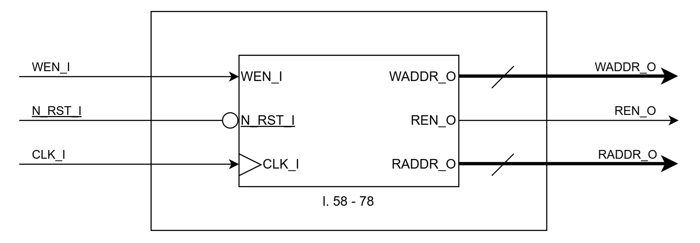
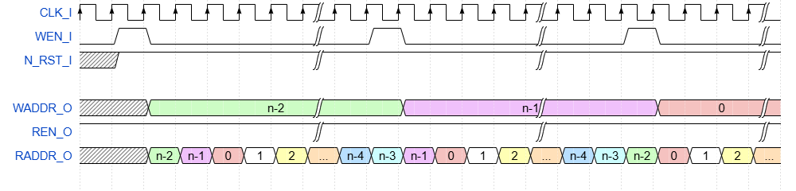
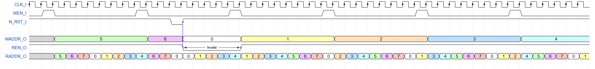

# FIREEEE_RAM_CTRL
Single clock simple dual-port RAM controller.

## File List
| No. |          File name           |         Description         |
|:---:|:-----------------------------|:----------------------------|
|1    |README.md                     |Module Specification         |
|2    |FIREEEE_RAM_CTRL.v            |Module                       |
|3    |FIREEEE_RAM_CTRL_tb.sv        |Testbench                    |
|4    |fireeee_ram_ctrl_no_reset.v   |Instance (No Reset)          |
|5    |fireeee_ram_ctrl_sync_reset.v |Instance (Synchronous Reset) |
|6    |fireeee_ram_ctrl_async_reset.v|Instance (Asynchronous Reset)|
|7    |Sim                           |Simulation Scripts           |
|8    |Sby                           |SymbiYosys Configurations    |

## Status
|        Item        |  Status  |
|:-------------------|:--------:|
|Version             |0.01      |
|Date                |2026/03/14|
|Verified            |Yes       |
|Real Machine Checked|No        |

## Verified Methods
- RTL simulation
- Code coverage
- Formal property check
- SystemVerilog assertion

## Port Definition
### Input
Some inputs may not take effect depending on the RAM used in combination with this module. 
| Port name |   Description    |Synchronous / Asynchronous|Clock Domain|Active low|
|:----------|:-----------------|:------------------------:|:----------:|:--------:|
|CLK_I      |Clock             |-                         |-           |No        |
|WEN_I      |Write Enable      |Synchronous               |CLK_I       |No        |
|N_RST_I    |Reset             |Synchronous / Asynchronous|CLK_I       |Yes       |

### Output
| Port name |   Description    |Synchronous / Asynchronous|Clock Domain|Active low|
|:----------|:-----------------|:------------------------:|:----------:|:--------:|
|WADDR_O    |Write Address     |Synchronous               |CLK_I       |No        |
|REN_O      |Read Enable       |Synchronous               |CLK_I       |No        |
|RADDR_O    |Read Address      |Synchronous               |CLK_I       |No        |

## Parameters  
| Parameter name | Description  |   Default Value   |
|:---------------|:-------------|:-----------------:|
|RESET_EN        |Reset Enable  |1'b1 (Enable)      |
|ASYNC_RESET_EN  |Reset Type    |1'b1 (Asynchronous)|
|ADDR_WIDTH      |Address Width |8 (Addr: 0 - 255)  |

## Block Diagram  

## Timing Chart
### Normal Operation
  
- Assume that there are n addresses ranging from 0 to n−1.
- WADDR_O is incremented by one each time WEN_I becomes High.
- At that moment, RADDR_O is set to the same value as WADDR_O.
- After that, RADDR_O is incremented by one on every CLK_I cycle until WEN_I becomes High again.
- Unless a reset occurs or there is a configuration error, the value of RADDR_O at the time when WEN_I next becomes High will be one less than the value of WADDR_O.
- In general, the number of addresses n is determined by the following equation:  
n = (frequency of CLK_I) ÷ ((frequency of DCLK_I) x (Oversampling Ratio)).
### Reset
  
- When the reset becomes active (N_RST_I goes Low), WADDR_O and RADDR_O are both set to 0, and REN_O is also set to Low.
- When the reset is deasserted, RADDR_O begins incrementing by one in the same manner as in normal operation. However, REN_O remains Low until WEN_I becomes High.
- Normal operation starts when WEN_I becomes High for the first time after the reset is released.
## Notes
- Some parameters may not function depending on the RAM module used in combination with this module.
- In principle, WEN_I should be connected to either POS_DET_O or NEG_DET_O of FIREEEE_DCLK_EDGE_DET. The signal applied to WEN_I must be asserted for only one CLK_I cycle. Operation with other types of signals has not been verified.
## Version History
### 0.00
- Initial Release of the Specification.  
### 0.01
- Add module & related files. (2026/03/15)
- Add simulation & verification results. (2026/03/15)

