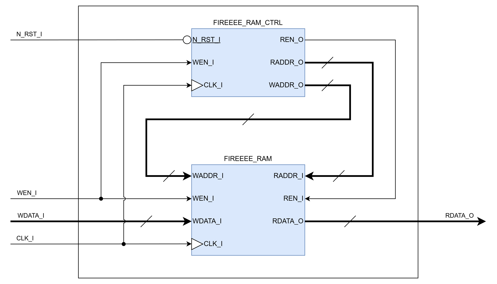

# FIREEEE_DATA_RAM
Input Data RAM

## File List
| No. |       File name       |    Description     |
|:---:|:----------------------|:-------------------|
|1    |README.md              |Module Specification|
|2    |FIREEEE_DATA_RAM.v     |Module              |
|3    |FIREEEE_DATA_RAM_tb.sv |Testbench           |
|4    |Sim                    |Simulation Scripts  |

## Status
|        Item        |  Status  |
|:-------------------|:--------:|
|Version             |0.01      |
|Date                |2026/03/17|
|Verified            |Yes       |
|Real Machine Checked|No        |

## Verified Methods
- RTL simulation
- Code coverage

## Port Definition
### Input
| Port name |   Description    |Synchronous / Asynchronous|Clock Domain|Active low|
|:----------|:-----------------|:------------------------:|:----------:|:--------:|
|CLK_I      |Clock             |-                         |-           |No        |
|WEN_I      |Write Enable      |Synchronous               |CLK_I       |No        |
|WDATA_I    |Write Data        |Synchronous               |CLK_I       |No        |
|N_RST_I    |Synchronous Reset |Synchronous / Asynchronous|CLK_I       |Yes       |

### Output
| Port name |   Description    |Synchronous / Asynchronous|Clock Domain|Active low|
|:----------|:-----------------|:------------------------:|:----------:|:--------:|
|RDATA_O    |Read Data         |Synchronous               |CLK_I       |No        |

## Parameters  
| Parameter name |             Description               |   Default Value   |
|:---------------|:--------------------------------------|:-----------------:|
|RESET_EN        |Reset Enable                           |1'b1 (Enable)      |
|ASYNC_RESET_EN  |Reset Type                             |1'b1 (Asynchronous)|
|RAM_DATA_WIDTH  |Data Width                             |32                 |
|RAM_ADDR_WIDTH  |Address Width                          |8 (Addr: 0 - 255)  |
|OUT_REG_EN      |Output Register Enable                 |1'b0 (Disable)     |
|RAM_INIT_FILE   |RAM Initialization Data File Name      |"" (None)          |

## Block Diagram  

## Timing Chart
TBD  
## Notes
- TBD  
## Version History
### 0.00
- Initial Release of the Specification.  
### 0.01
- Add module & related files. (2026/03/17)
- Add simulation & verification results. (2026/03/17)
