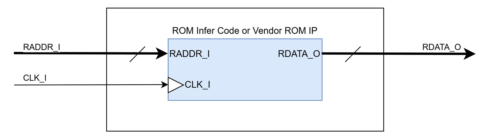

# FIREEEE_ROM
Single-port ROM wrapper.

## File List
| No. |    File name    |    Description     |
|:---:|:----------------|:-------------------|
|1    |README.md        |Module Specification|
|2    |FIREEEE_ROM.v    |Module              |
|3    |FIREEEE_ROM_tb.sv|Testbench           |
|4    |Sim              |Simulation Scripts  |

## Status
|        Item        |  Status  |
|:-------------------|:--------:|
|Version             |0.01      |
|Date                |2026/03/17|
|Verified            |Yes       |
|Real Machine Checked|No        |

## Port Definition
### Input
Some inputs may not take effect depending on the ROM used in combination with this module. 
| Port name |   Description    |Synchronous / Asynchronous|Clock Domain|Active low|
|:----------|:-----------------|:------------------------:|:----------:|:--------:|
|CLK_I      |Clock             |-                         |-           |No        |
|RADDR_I    |Write Address     |Synchronous               |CLK_I       |No        |

### Output
| Port name |   Description    |Synchronous / Asynchronous|Clock Domain|Active low|
|:----------|:-----------------|:------------------------:|:----------:|:--------:|
|RDATA_O    |Read Data         |Synchronous               |CLK_I       |No        |

## Parameters
Some parameters may not take effect depending on the ROM used in combination with this module.  
| Parameter name |             Description               | Default Value |
|:---------------|:--------------------------------------|:-------------:|
|DATA_WIDTH      |Data Bit Width                         |8              |
|ADDR_WIDTH      |Address Width                          |8              |
|OUT_REG_EN      |Output Register Enable                 |1'b0 (Disable) |
|ROM_INIT_FILE   |ROM Initialization File Name           |"initrom.hex"  |

## Block Diagram  

## Timing Chart
No timing chart in this module. Please see FIREEEE_COEF_ROM for actual operation.  
## Notes
- Some inputs and parametes may not take effect depending on the ROM used in combination with this module.
- You have to your own single clock simple dual-port RAM by define macro.

## Version History
### 0.00
Initial Release of the Specification.
### 0.01
- Add module & related files. (2026/03/17)
- Add simulation & verification results. (2026/03/17)
