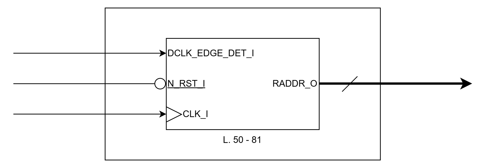
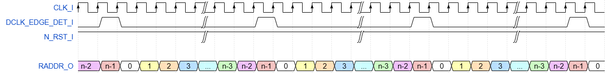

# FIREEEE_ROM_CTRL
Single-port ROM controller.

## File List
| No. |          File name           |         Description         |
|:---:|:-----------------------------|:----------------------------|
|1    |README.md                     |Module Specification         |
|2    |FIREEEE_ROM_CTRL.v            |Module                       |
|3    |FIREEEE_ROM_CTRL_tb.sv        |Testbench                    |
|4    |fireeee_rom_ctrl_no_reset.v   |Instance (No Reset)          |
|5    |fireeee_rom_ctrl_sync_reset.v |Instance (Synchronous Reset) |
|6    |fireeee_rom_ctrl_async_reset.v|Instance (Asynchronous Reset)|
|7    |Sim                           |Simulation Scripts           |
|8    |Sby                           |SymbiYosys Configurations    |

## Status
|        Item        |  Status  |
|:-------------------|:--------:|
|Version             |0.01      |
|Date                |2026/03/21|
|Verified            |Yes       |
|Real Machine Checked|No        |

## Verified Methods
- RTL simulation
- Code coverage
- Formal property check
- SystemVerilog assertion

## Port Definition
### Input 
|   Port name   |       Description        |Synchronous / Asynchronous|Clock Domain|Active low|
|:--------------|:-------------------------|:------------------------:|:----------:|:--------:|
|CLK_I          |Clock                     |-                         |-           |No        |
|DCLK_EDGE_DET_I|Data Clock Edge Detection |Synchronous               |CLK_I       |No        |
|N_RST_I        |Synchronous Reset         |Synchronous / Asynchronous|CLK_I       |Yes       |

### Output
| Port name |   Description    |Synchronous / Asynchronous|Clock Domain|Active low|
|:----------|:-----------------|:------------------------:|:----------:|:--------:|
|RADDR_O    |Read Address      |Synchronous               |CLK_I       |No        |

## Parameters  
| Parameter name | Description  |   Default Value   |
|:---------------|:-------------|:-----------------:|
|RESET_EN        |Reset Enable  |1'b1 (Enable)      |
|ASYNC_RESET_EN  |Reset Type    |1'b1 (Asynchronous)|
|ROM_ADDR_WIDTH  |Address Width |6 (Addr: 0 - 63)   |

## Block Diagram  

## Timing Chart

## Version History
### 0.00
- Initial Release of the Specification.  
### 0.01
- Add module & related files. (2026/03/21)
- Add simulation & verification results. (2026/03/21)
- Add Diagrams (2026/03/21)
