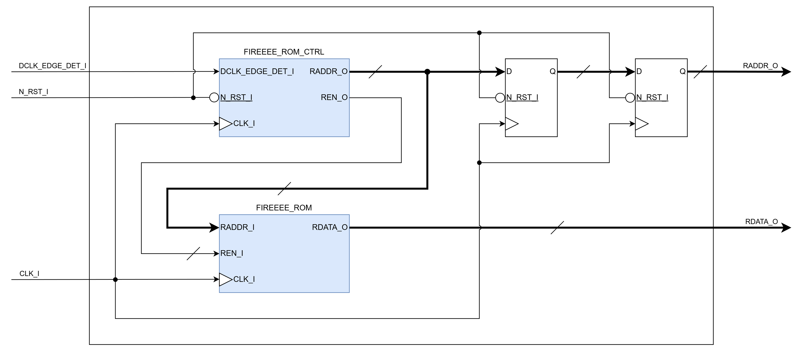
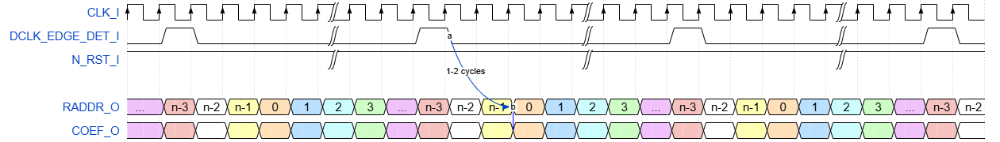

# FIREEEE_COEF_ROM
Filter Coefficient ROM

## File List
| No. |          File name           |         Description         |
|:---:|:-----------------------------|:----------------------------|
|1    |README.md                     |Module Specification         |
|2    |FIREEEE_COEF_ROM.v            |Module                       |
|3    |FIREEEE_COEF_ROM_tb.sv        |Testbench                    |
|4    |Sim                           |Simulation Scripts           |

## Status
|        Item        |  Status  |
|:-------------------|:--------:|
|Version             |0.01      |
|Date                |2026/03/22|
|Verified            |Yes       |
|Real Machine Checked|No        |

## Verified Methods
- RTL simulation
- Code coverage
- SystemVerilog assertion

## Port Definition
### Input
|   Port name   |      Description        |Synchronous / Asynchronous|Clock Domain|Active low|
|:--------------|:------------------------|:------------------------:|:----------:|:--------:|
|CLK_I          |Clock                    |-                         |-           |No        |
|DCLK_EDGE_DET_I|Data Clock Edge Detection|Synchronous               |CLK_I       |No        |
|N_RST_I        |Synchronous Reset        |Synchronous / Asynchronous|CLK_I       |Yes       |

### Output
| Port name |   Description    |Synchronous / Asynchronous|Clock Domain|Active low|
|:----------|:-----------------|:------------------------:|:----------:|:--------:|
|RADDR_O    |Read Address      |Synchronous               |CLK_I       |No        |
|RDATA_O    |Read Data         |Synchronous               |CLK_I       |No        |

## Parameters  
| Parameter name |             Description               |   Default Value   |
|:---------------|:--------------------------------------|:-----------------:|
|RESET_EN        |Reset Enable                           |1'b1 (Enable)      |
|ASYNC_RESET_EN  |Reset Type                             |1'b1 (Asynchronous)|
|ROM_DATA_WIDTH  |Data Width                             |32                 |
|ROM_ADDR_WIDTH  |Address Width                          |9 (Addr: 0 - 511)  |
|OUT_REG_EN      |Output Register Enable                 |1'b0 (Disable)     |
|ROM_INIT_FILE   |ROM Initialization Data File Name      |"initrom.hex"      |

## Block Diagram  

## Timing Chart

## Notes
- TBD  
## Version History
### 0.00
- Initial Release of the Specification.  
### 0.01
- Add module & simulation results. (2026/03/22)
