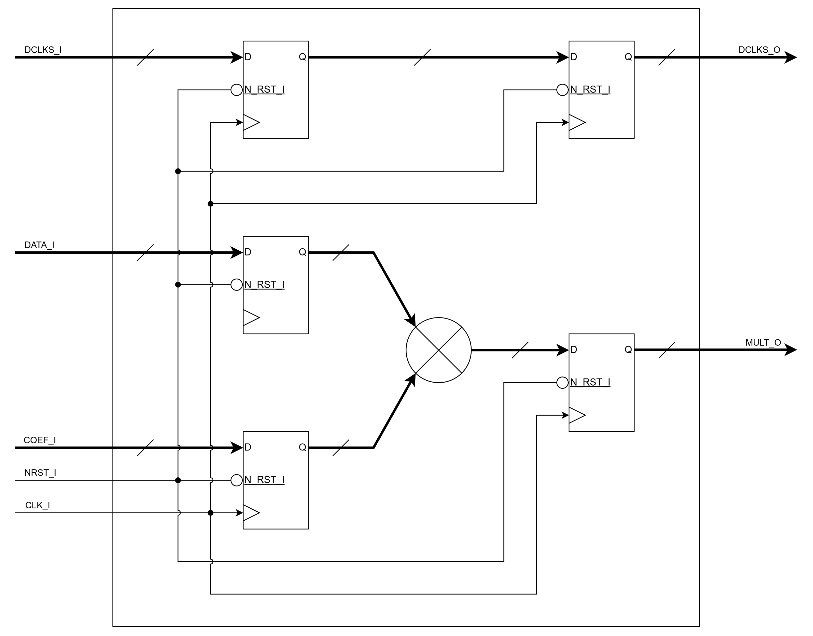
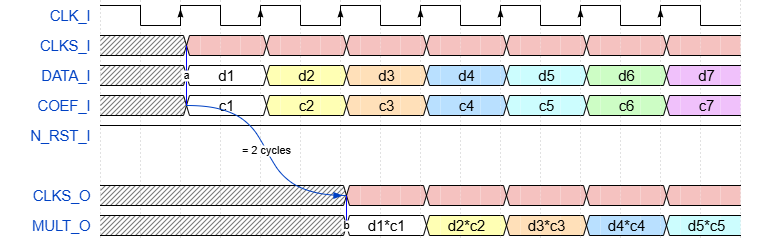

# FIREEEE_MULT
Data & Coefficient Multiplier

## File List
| No. |          File name           |         Description         |
|:---:|:-----------------------------|:----------------------------|
|1    |README.md                     |Module Specification         |
|2    |FIREEEE_MULT.v                |Module                       |
|3    |FIREEEE_MULT_tb.sv            |Testbench                    |
|4    |fireeee_mult_no_reset.v       |Instance (No Reset)          |
|5    |fireeee_mult_sync_reset.v     |Instance (Synchronous Reset) |
|6    |fireeee_mult_async_reset.v    |Instance (Asynchronous Reset)|
|7    |Sim                           |Simulation Scripts           |

## Status
|        Item        |  Status  |
|:-------------------|:--------:|
|Version             |0.01      |
|Date                |2026/03/29|
|Verified            |Yes       |
|Real Machine Checked|No        |

## Verified Methods
- RTL simulation
- Code coverage

## Port Definition
### Input
|   Port name   |       Description         |Synchronous / Asynchronous|Clock Domain|Active low|
|:--------------|:--------------------------|:------------------------:|:----------:|:--------:|
|CLK_I          |Clock                      |-                         |-           |No        |
|CLKS_I         |Data & Other Clocks        |Synchronous               |CLK_I       |No        |
|DATA_I         |Data from RAM              |Synchronous               |CLK_I       |No        |
|COEF_I         |Filter Coefficient from ROM|Synchronous               |CLK_I       |No        |
|N_RST_I        |Reset                      |Synchronous / Asynchronous|CLK_I       |Yes       |

### Output
| Port name |    Description    |Synchronous / Asynchronous|Clock Domain|Active low|
|:----------|:------------------|:------------------------:|:----------:|:--------:|
|CLKS_O     |Data & Other Clocks|Synchronous               |CLK_I       |No        |
|MULT_O     |Multiplied Data    |Synchronous               |CLK_I       |No        |

## Parameters  
| Parameter name |             Description               |   Default Value   |
|:---------------|:--------------------------------------|:-----------------:|
|RESET_EN        |Reset Enable                           |1'b1 (Enable)      |
|ASYNC_RESET_EN  |Reset Type                             |1'b1 (Asynchronous)|
|CLKS_WIDTH      |The number of Clocks                   |2                  |
|DATA_BIT_WIDTH  |Data Bit Width                         |32                 |
|COEF_BIT_WIDTH  |Coefficient Bit Width                  |32                 |
|IN_REG_EN       |Input Register Enable                  |1'b1 (Enable)      |
|OUT_REG_EN      |Output Register Enable                 |1'b1 (Enable)      |

## Block Diagram
Note: This diagram shows the schematic when IN_REG_EN == 1'b1 and OUT_REG_EN == 1'b1.  

## Timing Chart
Note: This chart shows the schematic when IN_REG_EN == 1'b1 and OUT_REG_EN == 1'b1.  

## Notes
- TBD  
## Version History
### 0.00
- Initial Release of the Specification.
### 0.01
- Add module & related files. (2026/03/29)
- Add simulation & verification results. (2026/03/29)
